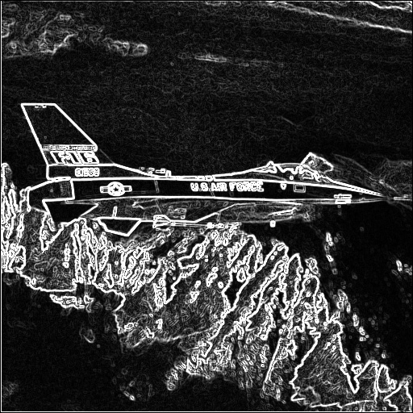
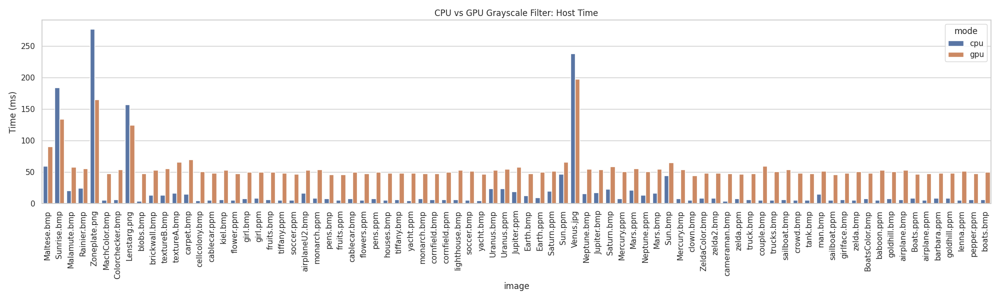
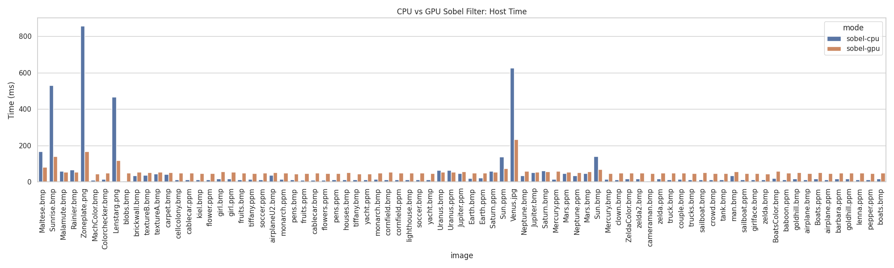
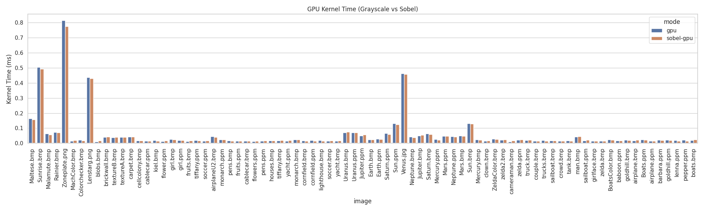

# simpleImageFilters

A high-performance grayscale and Sobel image filter library implemented in both CPU (C++) and GPU (CUDA). This project benchmarks the performance difference between CPU and GPU pipelines, demonstrating the speedups possible with CUDA acceleration.

---

##  Features

- Grayscale filter (CPU + CUDA)
- Sobel edge detection (CPU + CUDA)
- Automatic benchmarking across multiple images
- Python benchmarking and visualization
- Clean modular CMake project
- Works with `.jpg`, `.png`, `.bmp`, and `.ppm`

---

##  Sample Results

| Input Image | CPU Grayscale | GPU Grayscale | CPU Sobel | GPU Sobel |
|-------------|----------------|----------------|------------|------------|
|  |  |  |  |  |

---

##  Performance

Benchmarks were run on an NVIDIA RTX 3050 Ti Mobile GPU. All filters show consistent speedups with increasing image size.

### Grayscale Filter (Host Time)


### Sobel Filter (Host Time)


### GPU Kernel Execution Time (ms)


---

## Building
To build the project using CMake and Make:

# Clone the repository
git clone https://github.com/jrubin22/simpleImageFilters.git
cd simpleImageFilters

# Create a build directory
mkdir build
cd build

# Configure the project using CMake
cmake ..

# Compile the project using all available cores
make -j$(nproc)
After building, the image_filter binary will be located inside the build/ directory.

You can then run it like this:

./image_filter <input_image> <output_image> <mode>
Example:

./image_filter ../data/STI/Classic/airplane.ppm airplane_output.jpg gpu


---
##  Benchmarking

This project includes a Python wrapper to run all 4 filters on a directory of images and collect performance metrics.

```bash
# Install dependencies
pip install -r benchmarks/requirements.txt

# Run benchmarks
python benchmarks/benchmark.py --input_dir data/STI --output results.csv

# Generate plots
python benchmarks/plot_results.py results.csv
